# 共飞直连客户端（超详细小白版）快速使用手册

> 适合直接发给用户看的版本。  
> 目标：让用户按顺序完成「下载解压 → 双击打开 → 注册 → 登录 → 安装 ChatGPT → 切换分组 → 充值 → 切换模型 / 推理强度」。
>
> 说明：ChatGPT 的界面文案可能因语言不同而变化。本文只保留能对应上的关键入口，不额外猜测英文按钮名。

---

## 1. 下载、解压并打开客户端

先把客户端下载安装到本地，再解压出来，然后双击打开。

操作：

1. 下载客户端压缩包。  
2. 右键或直接解压到一个文件夹。  
3. 进入解压后的目录，双击客户端程序打开。  
   双击打开客户端程序。  
   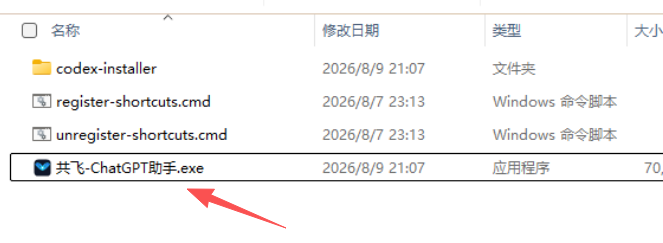

---

## 2. 注册

如果你还没有账号，先注册。

操作：

1. 打开客户端，进入登录页。  
   客户端登录页。  
2. 点击“还没有账号？注册”。  
   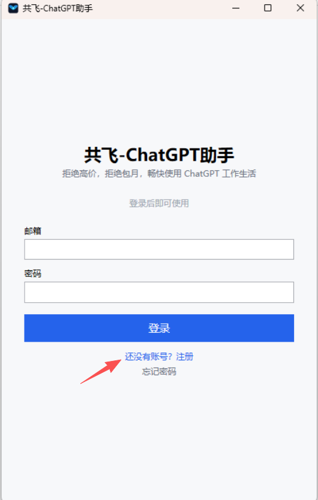
3. 填写注册邮箱和密码，点击“发送验证码”。

   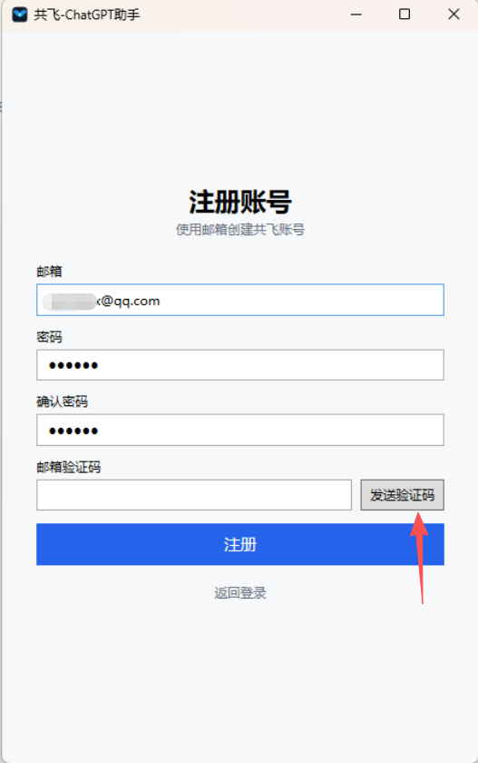
4. 打开你的注册邮箱，查收验证码邮件。
5. 把邮件里的验证码填回客户端，完成其他验证后点击“注册”提交。

   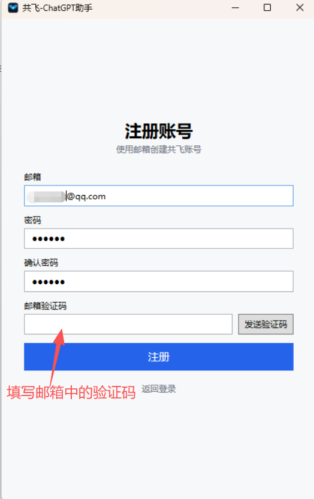

> 如果没有看到注册入口，说明当前服务器暂未开放注册。
>
> 收不到验证码时，请先检查垃圾邮件 / 广告邮件文件夹，再确认邮箱地址填写正确。

---

## 3. 登录

注册完成后，回到登录页登录。

操作：

1. 输入邮箱和密码，点击“登录”。  
   图6：登录表单。  
   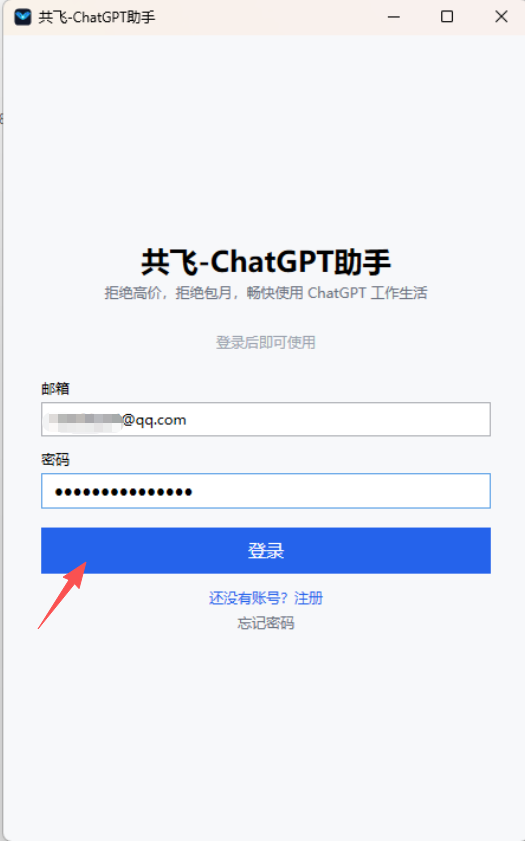
2. 如有协议勾选或二次验证，按页面提示完成。
3. 登录成功后进入主界面。  
   图7：登录成功后的主界面。  
   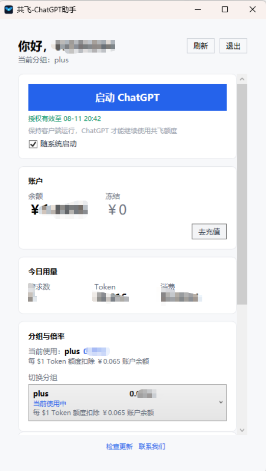

登录后通常能看到：

- 当前账号信息
- 当前分组
- 余额 / 用量
- “安装 ChatGPT”或“启动 ChatGPT”
- “去充值”

---

## 4. 安装 ChatGPT

如果电脑上还没有 ChatGPT，先安装。

操作：

1. 在主界面点击“安装 ChatGPT”。  
   图8：主界面上的“安装 ChatGPT”按钮。  
   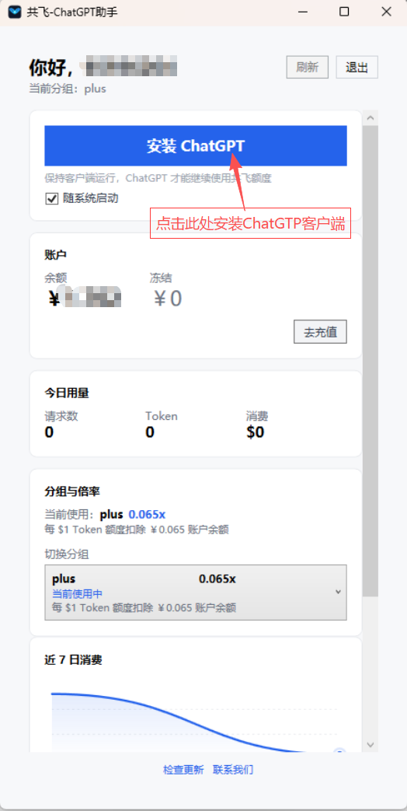
2. 等待客户端下载 ChatGPT 安装包。  
   图9：ChatGPT 安装包下载完成后的状态。  
   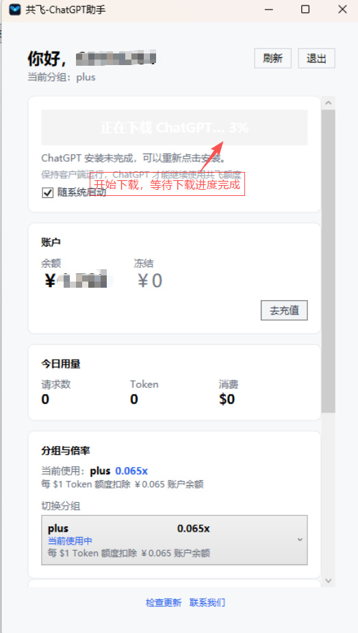
3. 下载完成后，ChatGPT 安装程序会自动弹出。  
4. 在安装程序中点击 “Install”。  
   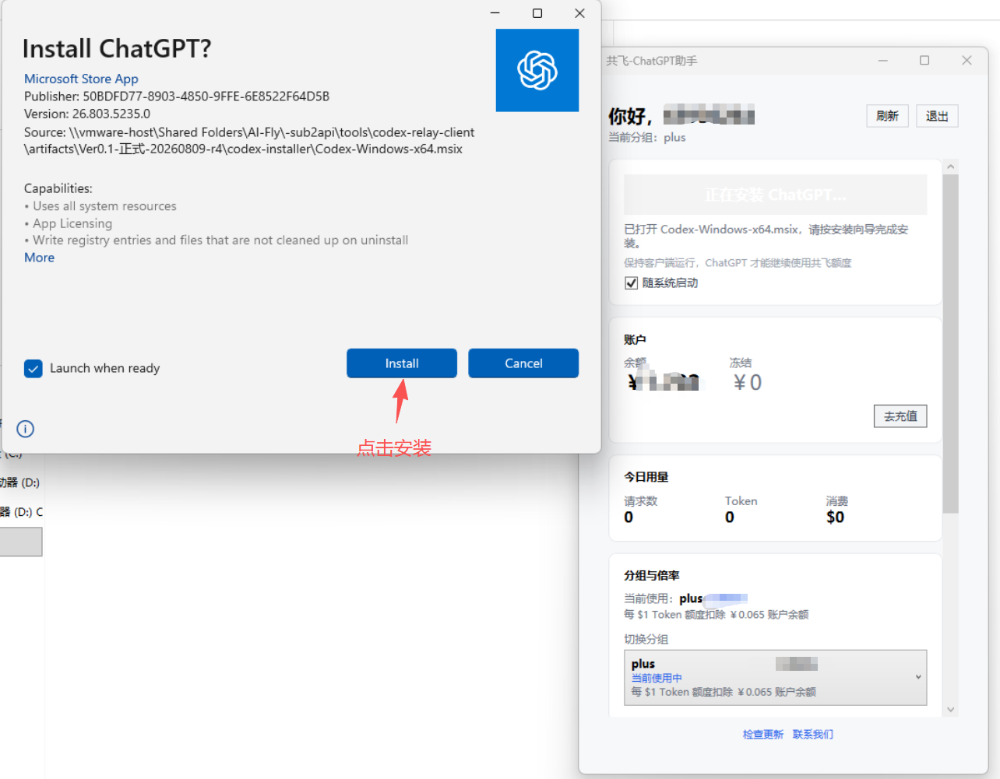
5. 等待安装完成，稍做等待，安装完成会自动拉起ChatGPT客户端。

   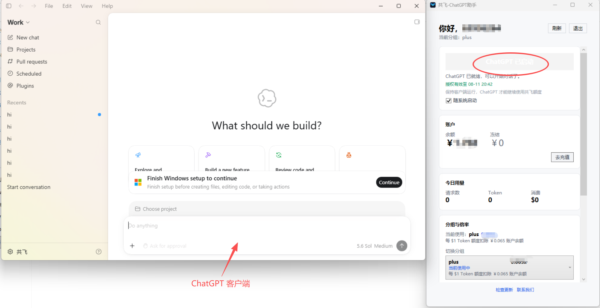

> 如果你已经安装过，按钮通常会显示为“启动 ChatGPT”。

---

## 5. 切换分组

分组可以理解为当前账号使用的线路 / 策略。

操作：

1. 在主界面找到“当前分组”或“切换分组”。  
   图12：分组切换区域。  
   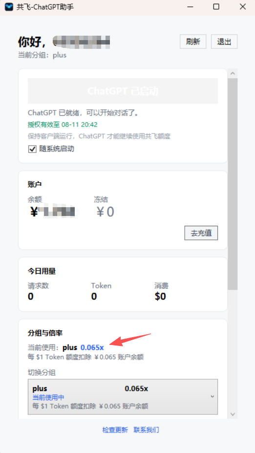
2. 点击下拉框，选择要使用的分组。  
   图13：分组下拉选项。  
   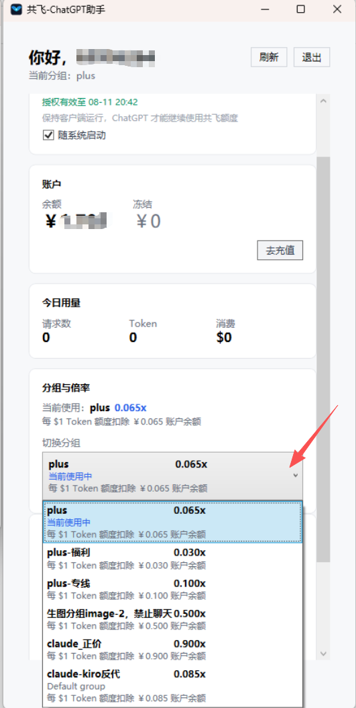
3. 等待切换完成，确认当前分组已更新。

> 切换后，倍率、余额折算、可用模型可能会变化。

---

## 6. 充值

余额不够时，可以直接在客户端里充值。

操作：

1. 点击“去充值”。  
   图14：主界面上的“去充值”入口。  
   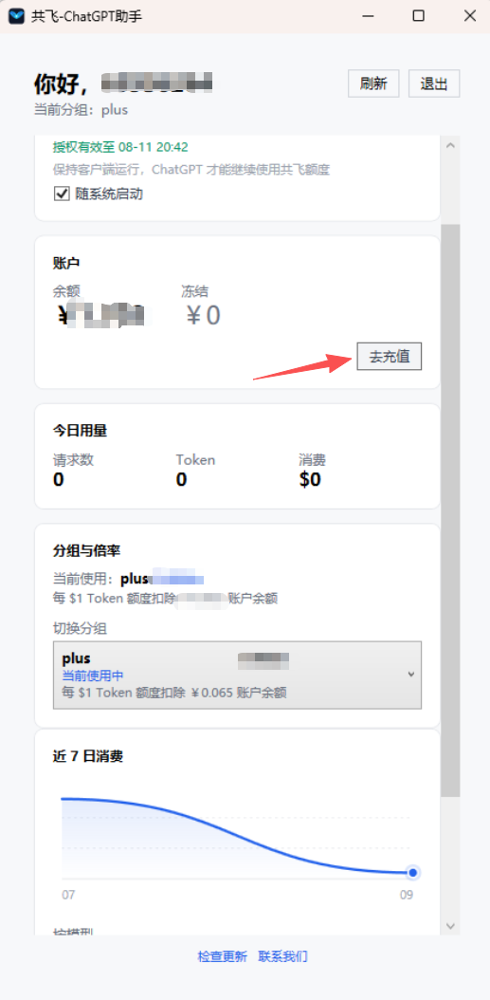
2. 选择充值金额，或手动输入金额。  
   图15：充值金额选择页面。  
   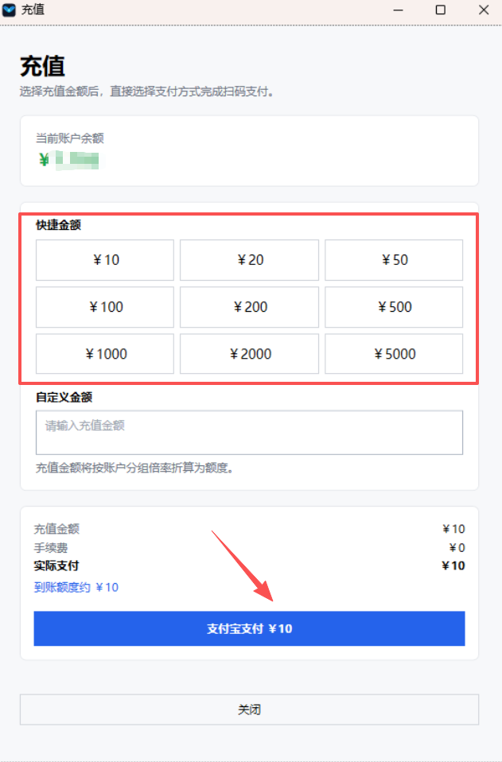
3. 选择支付方式并扫码完成支付。  
   图16：扫码支付页面。  
   
4. 支付成功后等待余额刷新。  
   图17：充值成功后的提示或余额更新。  
   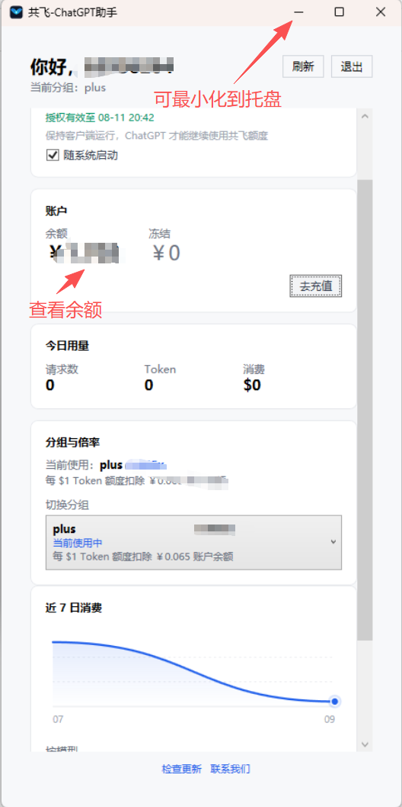

充值页通常会显示：

- 当前余额
- 充值金额
- 手续费
- 实际支付金额
- 支付二维码

---

## 7. 在 ChatGPT 里切换模型和推理强度

ChatGPT 启动后，可以直接切换模型。

操作：

1. 打开 ChatGPT。
2. 点击对话顶部的模型按钮。  
   图18：ChatGPT 模型按钮。  
   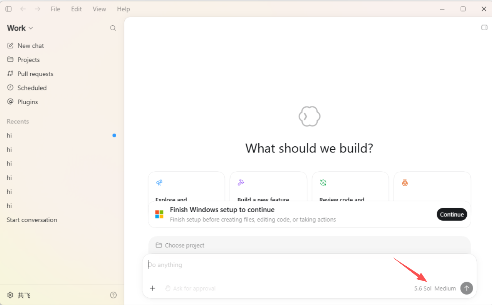
3. 选择需要的模型和推理强度。  
   图19：模型下拉列表。  
   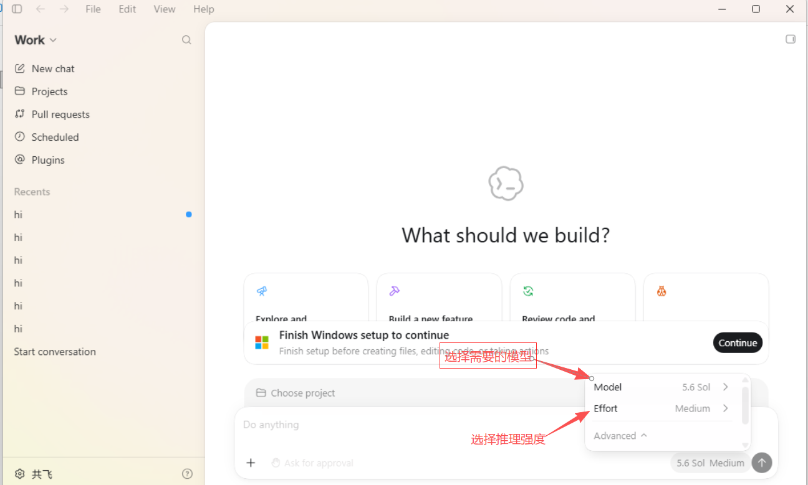
4. 开始对话。
   图20：模型下拉列表。  
   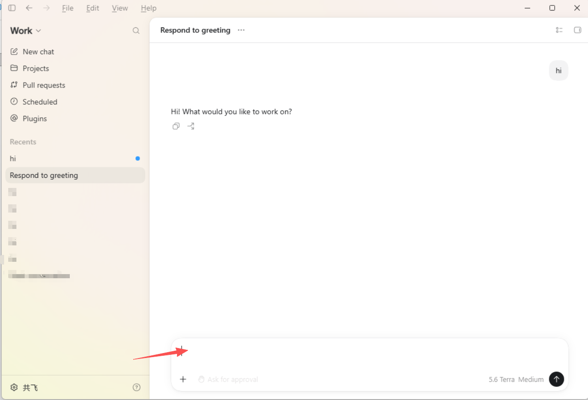

一般建议：

- 简单问答：优先用 GPT-5.5 Instant；
- 日常写作、整理、普通分析：优先用 GPT-5.6 Terra；
- 复杂编码、研究、深度分析：优先用 GPT-5.6 Sol；
- 追求更快、更省：优先用 GPT-5.6 Luna（如果你的账号里看得到）。

| 模型 | 特点 | 价格感受 | 适合场景 |
|---|---|---|---|
| GPT-5.5 | 能力强，偏重复杂任务 | 贵 | 编码、研究、深度分析 |
| GPT-5.6 Luna | 最快、最省 | 便宜 | 追求速度和成本的轻量任务 |
| GPT-5.6 Terra | 能力、速度、成本更均衡 | 中 | 大多数日常使用 |
| GPT-5.6 Sol | 用于更复杂的任务 | 贵 | 编码、研究、深度分析 |

> 模型入口就是 ChatGPT 里的“模型”按钮；英文界面请找同一位置的 Model 入口。
>
> 价格感受按 OpenAI 官方价格表做的粗略区分：GPT-5.6 Luna 最便宜，GPT-5.6 Terra 居中，GPT-5.6 Sol 和 GPT-5.5 都属于更贵的一档。实际页面如果显示的是信用点、额度或套餐消耗，以页面显示为准。

---

## 8. ChatGPT 推理强度说明

部分模型支持设置推理强度，也就是思考强度。

常见档位：

| 挡位 | 英文按钮名 | 说明 |
|---|---|---|
| 低 | Instant | 更快，适合简单问题 |
| 中 | Medium | 平衡速度和质量 |
| 高 | High | 更认真地分析问题 |
| 极高 | Extra High | 最强推理，适合复杂任务 |

> 推理强度入口就是 ChatGPT 里的“推理强度”；英文界面请找同一位置的 Instant、Medium、High、Extra High 按钮。

## 9. 添加桌面和开始菜单快捷方式

在解压目录中双击 “注册桌面和开始菜单快捷方式”。
切记不要删除此目录，程序是免安装的，这就是你的程序目录，删除后将无法使用。

   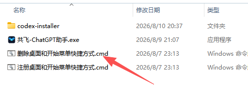

## 10. 最简单的一句话流程

“先下载解压并双击打开，再注册登录，接着安装 ChatGPT，切换分组，余额不够就充值，最后在 ChatGPT 里选模型和推理强度。”
