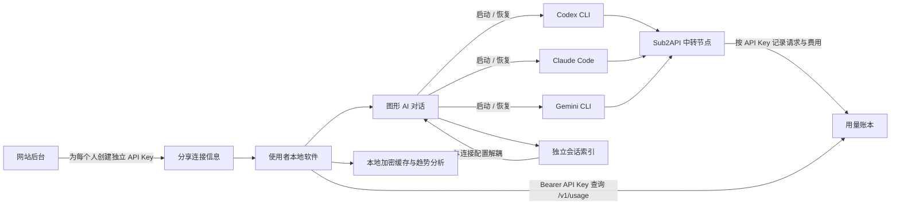

# 局域网 AI 工作台：产品、技术与 UX 设计方案

> 版本：v1.4 Reviewed Draft  
> 日期：2026-07-13  
> 状态：产品口径、会话架构与视觉方向已确认；图形对话、官方历史永久删除与高级终端回退已完成本阶段实现验证  
> 产品定位：局域网 AI 中转客户端 + 图形 AI 对话工作台 + 中转主机控制台

## 1. 已确认的产品决策

1. 产品按“每个人”展示用量，服务端实际统计实体是 API Key；通过“一人一把独立 Key”的分配规则建立人与统计档案的对应关系。
2. 同一个人在多台电脑使用同一把 Key 时，用量合并为该 Key 的总用量。系统无法识别人，也无法阻止多人共用同一把 Key。
3. 软件不负责服务端 API Key 的创建、限额、轮换或撤销；这些生命周期管理动作继续在 Sub2API 网站后台完成。软件仍会在本机接收、测试、安全保存 Key，并按用户选择写入客户端配置。
4. 使用者只需中转地址和 API Key，无需站内账号或密码。
5. 新界面接受逐步迁移到 .NET 8 WPF；现有 WinForms 版本在迁移期间继续保留。
6. 外部授权使用者使用公网中转时必须采用 HTTPS；局域网 HTTP 仅用于可信局域网。
7. 软件名称使用描述性的“局域网 AI 工作台”，并使用新的中性局域网节点图标。现有飞机头像不再作为产品图标。
8. 保留现有飞机个人头像，与“软件作者 · 归年”一起固定放在侧栏底部，不作为软件主标题、任务栏图标或托盘图标。
9. 视觉改为克制、精致的 Apple 风格：浅灰画布、半透明侧栏、纯白内容层和系统蓝强调色。
10. 软件默认提供按项目组织的图形 AI 对话界面与统一历史会话索引；连接或 API Key 切换不能影响历史会话的可见性。
11. 图形界面直接承载 Codex app-server、Claude Code stream-json、Gemini ACP 等真实官方 CLI 协议；高级终端仅作为尚未结构化呈现能力的回退入口。
12. 项目是会话管理的一级容器。每个项目绑定根目录、默认 CLI、默认连接、模型策略和全部历史会话；连接切换不能改变项目归属。
13. 用户确认删除项目时，同步永久删除该项目在 Codex、Claude Code、Gemini CLI 中的官方历史，再删除本机 SQLite 项目记录；源码文件夹保留。任一官方删除失败时保留本地项目记录并显示具体原因，不使用忽略名单掩盖失败。

## 2. 产品目标

### 2.1 核心目标

- 一台局域网主机运行 Sub2API，同一局域网内其他电脑通过该节点使用。
- 主机可以把独立 API Key 分享给朋友，不需要分享站内账号。
- 使用者只需粘贴“中转地址 + API Key”，即可配置 Codex、Claude Code、Gemini 等客户端。
- 使用者可以在本地软件中查看本人历史用量、消费趋势、模型偏好和额度状态。
- 使用者可以直接从软件启动 Codex、Claude Code 或 Gemini CLI 会话。
- 所有被软件创建或识别的会话进入独立历史索引，切换中转来源后仍可查找、预览和继续。
- 使用者可以按项目集中查看会话、连接策略、CLI 配置、用量和最近活动。
- 主机维护能力与普通使用能力清晰分离，减少非技术用户看到的复杂信息。

### 2.2 非目标

- 第一版不在本地软件内创建、编辑或撤销网站用户和 API Key。
- 第一版不复制完整的 Sub2API 管理后台。
- 第一版不开发本地透明代理或请求中间人。
- 第一版不承诺在多人共享同一 API Key 时区分个人用量。
- 第一版不把 PostgreSQL、Redis、Docker 等运维信息展示给普通使用者。
- 第一版不承诺复制 Codex、Claude Code、Gemini 官方 App 的全部界面、云端能力和私有内部协议。
- 除用户明确确认的永久删除外，第一版不修改或迁走官方客户端的原始会话文件；日常索引只读，恢复和删除优先调用官方 CLI 能力。

## 3. 用户角色

### 3.1 使用者

持有中转地址和个人 API Key，主要需求：

- 快速完成客户端配置。
- 确认当前连接是否可用。
- 从一个入口新建、继续和搜索不同 CLI 的会话。
- 查看自己的请求、Token、费用、额度和趋势。
- 在多台电脑之间使用同一把个人 Key，并看到合并统计。

### 3.2 主机维护者

在局域网主机上运行 Sub2API，主要需求：

- 启动、停止、重启和检查本机服务。
- 查看本机和局域网访问地址。
- 复制分享信息给局域网设备或外部授权使用者。
- 打开网站后台创建和管理独立 API Key。
- 快速定位端口、数据库、网络和上游连接故障。

### 3.3 双重角色

主机维护者也会在本机使用 Codex、Claude Code 等客户端。软件允许同时启用“使用端”和“主机端”能力。

纯主机角色默认只显示主机总览、主机控制台、诊断中心和设置。若未配置个人连接，不展示个人用量卡片；用户以后添加个人连接后再启用完整使用端导航。

## 4. 首次启动向导

首次运行时提供三个入口：

1. **我只使用中转**
   - 输入连接名称、中转地址、API Key。
   - 测试连接后进入使用端首页。
   - 隐藏服务启动和数据库相关信息。

2. **我在这台电脑提供中转**
   - 检查 Sub2API 本地环境。
   - 配置是否允许局域网访问。
   - 显示本机、局域网地址和服务健康状态。

3. **两者都需要**
   - 同时创建个人连接档案并启用主机控制台。

## 5. 核心使用流程



## 6. 连接与来源模型

### 6.1 固定来源

- **本机中转**：固定名称，不可新增、删除或改名。
- **局域网中转**：固定名称，不可新增、删除或改名。

允许编辑：

- 中转地址
- API Key
- 客户端默认模型
- 备注

### 6.2 云端来源

云端来源支持新增、删除、改名，用于不同公网中转站或不同服务提供者。

### 6.3 建议的数据模型

```text
ConnectionProfile
  id
  name
  type: local | lan | cloud
  base_url
  api_key_credential_id
  enabled_clients[]
  default_models{}
  notes
  last_health_check_at
  last_latency_ms
```

API Key 不写入该配置对象，只保存 Windows 凭据保险箱中的引用。

## 7. 客户端配置语义

每个客户端字段提供显式状态：

- **由工具管理**：软件写入地址、密钥和模型。
- **保持原状**：软件不修改该客户端现有配置。

不再依靠空输入框表达“保持原状”。

支持的客户端：

- Codex
- Claude Code
- Gemini CLI

Grok 属于上游账号与模型。推荐通过 Sub2API 的 Grok 分组和模型路由供 Codex 使用，不单独设计一个不存在统一配置标准的 Grok 本地客户端。

### 7.2 命令行启动语义

- 外部客户端配置仍可使用“由工具管理 / 保持原状”。
- 从本软件启动的命令行会话使用子进程级参数、环境变量或临时配置层，不为每个会话反复覆盖全局主配置。
- 始终保留同一个用户 HOME、`CODEX_HOME` 和各客户端原始会话目录，避免人为制造互相隔离的历史仓库。
- 新会话默认使用当前连接；已有会话的可见性与当前连接无关。
- 继续旧会话时可以选择“使用当前连接”或“使用原连接”。若客户端不支持跨来源原生恢复，软件提供“复制上下文到新会话”，并明确标注为分叉会话。

## 8. API Key 用量统计

### 8.1 当前可复用接口

```http
GET /v1/usage?days=30&timezone=Asia/Shanghai
Authorization: Bearer <API Key>
```

当前接口已具备：

- 今日与累计请求数
- 输入、输出、缓存 Token
- 标价费用 `cost`
- 实际扣费 `actual_cost`
- RPM、TPM、平均耗时
- 1～90 天每日用量
- 指定日期范围的模型统计
- API Key 总额度、限速窗口和到期状态

### 8.2 展示口径

- 首页和主图统一使用 `actual_cost`，表达真实扣费。
- `cost` 仅在费用详情中作为模型标价参考。
- 多台设备使用同一把个人 Key 时展示该 Key 的合计数据，第一版不按设备拆分。
- 一把 Key 对应一个独立统计档案。Key 被更换后创建新档案，旧历史保留但不自动合并。
- 多 Key 合并分析属于阶段 5 增强能力，不进入 MVP。

### 8.3 上线前必须修正的隐私边界

API Key 查询接口只能返回当前 Key 自身的数据。需要移除或隔离：

- `model_stats.account_cost`：站方上游账号成本。
- 无限额 Key 所属用户的完整钱包余额。
- 用户级或用户+分组级订阅总额度。
- 任何其他 API Key、用户、账号或内部调度信息。

MVP 发布前必须提供版本化的 Key 级响应契约，例如：

```text
version
scope = api_key
generated_at
timezone
currency
summary: requests, tokens, cost, actual_cost, latency, rpm, tpm
daily[]: date, requests, token breakdown, cost, actual_cost
models[]: model, requests, tokens, cost, actual_cost
quota: key limit, used, remaining, reset/expiry, rpm/tpm limits
```

采用字段白名单，未列入契约的用户、钱包、订阅、上游账号和内部调度字段一律不返回。接口需要限制模型统计查询跨度，避免超大范围查询。桌面端遇到不支持该安全契约的旧服务端时，只显示兼容性提示，不展示可能越权的余额或成本字段。

### 8.4 统计语义

- `actual_cost` 使用接口返回的 `currency`；若旧接口没有币种，界面标注“站内计费单位”，不擅自显示美元符号。
- 每日数据按请求中的 IANA 时区切日；日期区间定义为 `[start_date 00:00, end_date + 1 日 00:00)`。
- “累计”表示服务端为该 Key 保留的全部历史，不等同于本机缓存时长；界面显示服务端给出的统计起点。
- 服务端发生补扣、退款或账单修正时，以后续快照覆盖相同日期和模型的旧缓存，不按差值重复累加。
- Key 删除后重新创建视为新 Key，即使显示名称相同，也不继承旧档案。

## 9. 本地统计与缓存

### 9.1 数据来源

Sub2API 服务端是权威账本。本地软件定期拉取当前 Key 的统计数据，并在本机生成派生分析。

### 9.2 同步策略

- 打开软件时同步一次。
- 前台运行时每 5～10 分钟自动同步。
- 点击刷新时立即同步。
- 离线时展示最后一次缓存，并明确标注更新时间。
- 初次接入最多读取过去 90 天；此后本地缓存可长期保留。
- 多设备一致性仅针对服务端仍可查询的时间窗口；每台设备完成同步后，允许最多“自动同步周期 + 1 分钟”的收敛延迟。
- 超出服务端回溯窗口的本地长期历史可能因设备首次接入时间不同而不同，界面必须标注“本机历史”。

### 9.3 本地数据库

建议使用 SQLite：

```text
usage_profiles
  profile_id PRIMARY KEY
  base_url_hash
  api_key_fingerprint
  display_name
  schema_version

usage_daily
  profile_id
  date
  requests
  input_tokens
  output_tokens
  cache_read_tokens
  cache_creation_tokens
  cost
  actual_cost
  UNIQUE(profile_id, date)

usage_models
  profile_id
  date_from
  date_to
  model
  requests
  tokens
  actual_cost
  UNIQUE(profile_id, date_from, date_to, model)

usage_snapshots
  profile_id
  captured_at
  quota_remaining
  rate_limit_state_json
  average_duration_ms
  rpm
  tpm
  UNIQUE(profile_id, captured_at)
```

数据库中不保存完整 API Key。`api_key_fingerprint` 使用每次安装独立盐值的 HMAC-SHA256，盐值由 DPAPI 保护，避免不同电脑之间形成可关联标识。数据库升级必须通过版本化迁移完成，相同唯一键的数据采用服务端新快照覆盖。

### 9.4 本地隐私与清理

- 完整 Key 只保存在 Windows Credential Manager 或 DPAPI 保护的凭据区；不进入普通 JSON、SQLite、日志、进程参数或崩溃报告。
- SQLite 放在当前 Windows 用户的应用数据目录，仅授予当前用户访问，默认保留 365 天；设置中可改为 90 天、180 天、365 天或永久。
- 删除连接档案时同时删除对应凭据、缓存和指纹关联；设置中提供“清除全部本地用量与凭据”。
- 卸载程序必须让用户选择保留或清除个人数据，默认清除凭据。
- 主动复制 Key 时需要二次确认，并在平台允许时于 60 秒后清理本软件写入的剪贴板内容。
- Codex、Claude Code 或 Gemini 的目标配置格式若只能明文保存 Key，应用前必须明确提示具体文件。验收中的“不明文落盘”仅约束本软件自身存储；客户端配置由其自身格式与权限边界决定。

### 9.5 本地派生指标

- 7 天、30 天移动平均
- 周环比、月环比
- 日均 Token 和日均实际费用
- 最高使用日和最常用模型
- 输入/输出/缓存 Token 构成
- 按当前速度估算的月度消耗
- 额度不足和 Key 即将过期提醒

## 10. 图形对话、高级终端与历史会话

### 10.1 产品原则

软件提供统一图形入口，官方 CLI 仍是实际运行时。图形层将官方协议事件呈现为消息气泡、流式回答、工具卡片、进度、权限确认和用户补充输入，从而保留各客户端已有的工具调用、MCP、项目上下文和恢复能力。

第一版提供三层能力：

1. **图形 AI 对话**：默认入口。通过 Codex app-server、Claude Code 双向 stream-json、Gemini ACP 与真实官方 CLI 通信，按项目新建、恢复和管理会话。
2. **统一历史索引**：只读扫描各客户端的会话元数据，统一展示标题、客户端、项目目录、时间、原始会话 ID 与连接来源；用户打开历史会话时，再从官方客户端目录按需只读加载可展示正文，用户确认删除时调用官方删除能力。
3. **高级终端**：通过 Windows ConPTY 承载官方 CLI，仅用于官方协议暂未覆盖、需要原生命令或诊断的高级场景。

图形对话不是伪造的 API 聊天壳，也不自行模拟官方回复。所有回答、工具、权限和会话状态均来自对应官方 CLI 协议；协议能力不足时明确引导到高级终端。

### 10.2 已验证的恢复能力

当前机器安装版本提供以下入口：

- Codex：`resume`、`resume --all`、`fork`、`archive`、`delete`，并支持配置 profile 与命令级 `-c` 覆盖。
- Claude Code：`--resume`、`--continue`、`--session-id`、`--settings`，并支持流式 JSON 输出。
- Gemini CLI：`--resume`、`--list-sessions`、`--session-file`、`--session-id`，并支持结构化输出。

图形运行协议为 Codex app-server、Claude Code 双向 stream-json 和 Gemini ACP。适配器必须按客户端版本做能力探测，不能长期依赖未公开的原始 JSONL 结构。恢复和删除优先调用官方命令参数；除用户确认删除外，原始会话文件只读，不搬迁、不重写。

历史恢复采用“先展示、后连接”的顺序：进入历史会话后立即显示原始会话 ID，并从官方会话文件按需读取用户可见的消息正文；正文不复制到本软件 SQLite，也不形成第二份会话仓库。正文加载完成后，再通过官方图形协议恢复对应 session。原项目目录已经删除或暂时不可访问时，历史正文仍可查看，界面明确标记为“仅查看历史，无法继续”；项目目录有效时才启动官方引擎继续对话。

永久删除按客户端执行并验证：Codex 按原生 session ID 调用 `delete --force`；Claude Code 先执行 `project purge --dry-run` 预检，再执行 `project purge --yes` 并复检；Gemini 按原生 session ID 调用 `--delete-session`。仅当原项目目录已经不存在时，Gemini 才允许按精确 session ID 在官方本地会话目录执行受路径边界保护的文件回退清理。

### 10.3 “切换后历史消失”的处理

现有客户端通常会按当前工作目录、项目、账号或默认筛选条件展示会话。连接切换并不等于会话文件被删除。例如 Codex 默认按当前目录筛选，`resume --all` 才展示全部记录。

新版采用以下规则：

- `ConnectionProfile` 只描述请求走向和凭据。
- `ConversationRecord` 独立存在，不归属于当前选中的 Profile。
- 切换 API 或中转只改变新请求的执行上下文，不隐藏、不删除历史记录。
- 删除连接档案时保留历史会话，并把原来源标记为“已删除来源”。用户可以选择当前来源继续或恢复原来源后继续。
- 历史页默认跨客户端、跨工作目录、跨来源展示，并允许按这些维度筛选。

### 10.4 会话数据模型

```text
Project
  id
  display_name
  root_path
  path_fingerprint
  default_cli
  default_connection_profile_id
  default_model
  resume_policy: current | pinned
  created_at / last_opened_at
  archived

ConversationRecord
  id
  project_id
  native_client: codex | claude | gemini | managed
  native_session_id
  title
  original_working_directory
  created_at
  updated_at
  source_profile_id_at_start
  last_source_profile_id
  resume_policy: current | pinned
  storage_mode: native_index | encrypted_import | managed
  native_file_fingerprint
  status: available | source_missing | client_missing | archived

ConversationAnnotation
  conversation_id
  custom_title
  tags[]
  pinned
  notes

ConversationLaunch
  conversation_id
  connection_profile_id
  working_directory
  native_version
  started_at / ended_at
  exit_code
```

`Project.root_path` 规范化后唯一，一个项目可以包含多种 CLI 和多条会话。同一会话只能归属一个项目，但可以通过标签进入跨项目视图。会话唯一键建议为 `(native_client, native_session_id)`。工作目录、标题和内容预览属于敏感信息；若进入本软件数据库，使用加密 SQLite 或 DPAPI 保护的字段。第一版 SQLite 只保存恢复所需元数据，不复制完整正文；正文由 `IConversationTranscriptReader` 在用户打开会话时从官方存储按需只读加载，离开内存后不由工作区数据库持久化。

### 10.5 项目管理能力

- 从文件夹创建项目，或根据官方历史记录中的 `cwd` 自动发现项目候选。
- 项目首页显示默认 CLI、默认连接、模型、Git 分支、最近会话、累计 Token/费用和诊断状态。
- 点击“开始对话”后直接以项目根目录为工作目录启动真实官方 CLI。
- 新会话继承项目默认设置；启动前仍可临时选择其他 CLI、连接或模型。
- 一个项目内可以同时存在 Codex、Claude Code、Gemini 会话，并按客户端筛选。
- 移动或重命名项目目录后允许重新定位；软件通过路径指纹提示匹配，不擅自改写官方记录。
- 归档项目只从默认列表隐藏，不删除项目文件、会话或凭据。
- 删除项目先停止同一工作目录的图形会话和高级终端，再永久删除三类官方历史；全部成功后才删除本机 SQLite 项目记录，源码文件夹始终保留。
- 不存在的 `cwd` 不自动生成项目。用户删除项目后不写 tombstone 或忽略名单；只要官方历史已被真正删除，后续扫描就不会重新发现它。

### 10.6 历史页能力

- 搜索标题、客户端和工作目录。
- 按今天、昨天、最近 7 天、更早分组。
- 按 Codex、Claude Code、Gemini、连接来源和项目筛选。
- 选择记录后立即加载并展示官方历史正文，同时显示原始 session ID；正文只在当前查看过程按需读取，不写入 SQLite。
- 原项目目录失效时仍允许查看已经找到的官方历史正文，但禁用继续执行并显示“仅查看历史，无法继续”。
- 继续、使用当前连接分叉、置顶、重命名本地别名、归档、导出和永久删除。
- 永久删除必须二次确认，并显示 Codex、Claude Code、Gemini 的待删除会话数量。任一官方删除或验证失败时，保留本地项目记录和可见错误，避免界面显示“已删除”但官方历史仍存在。
- 只有成功识别原始 session ID 的记录显示“继续”；无法恢复的记录显示“查看记录”。

### 10.7 安全边界

- 嵌入终端不得在命令行参数、窗口标题或日志中暴露 API Key。
- 终端输出默认不写入普通日志；导出会话前执行密钥、Token 和常见凭据模式遮盖。
- 会话索引扫描只访问已知客户端目录，不读取浏览器 Cookie、密码库或其他用户目录；只有用户明确确认永久删除时才进入受限删除流程。
- 官方客户端更新导致格式未知时，停止解析正文并保留“用官方客户端打开”的退路。

## 11. 信息架构

### 11.1 使用端导航

1. 总览
2. 项目中心
3. AI 对话
4. 历史会话
5. 连接中心
6. 客户端配置
7. 用量洞察
8. 诊断中心
9. 设置

### 11.2 主机端附加导航

10. 主机控制台

主机控制台只在“主机端”或“双重角色”中出现。

纯主机角色的默认导航为：主机总览、主机控制台、诊断中心、设置。添加个人连接后可切换为双重角色。

## 12. 页面设计

### 12.1 总览

目标：首页首屏直接回答四个问题：

1. 当前连的是哪个中转？
2. 连接是否正常？
3. 今天用了多少？
4. 额度是否安全？

布局：

```text
┌──────────────────────────────────────────────────────────────┐
│ 当前连接：局域网中转  ● 32ms            最后同步 13:20      │
├───────────────────────┬──────────────────────────────────────┤
│ 今日实际消费          │ 局域网连接拓扑                       │
│ $1.24                 │ 本机 → 中转节点 → Codex / Claude    │
│ 128 次 · 2.3M Token   │                                      │
├───────────────────────┼──────────────────────────────────────┤
│ 最近 7 天趋势         │ 额度与状态                           │
│ 折线图                │ 剩余 $18.76 · Key 正常 · 无限速     │
├───────────────────────┴──────────────────────────────────────┤
│ 客户端：Codex 已配置 · Claude 保持原状 · Gemini 已配置      │
└──────────────────────────────────────────────────────────────┘
```

拓扑图表达“已配置的连接路径”，不宣称客户端此刻正在发送请求。MVP 没有透明代理或单机请求采集能力，因此只能显示已配置、配置异常或保持原状。

### 12.2 项目中心

- 卡片或列表显示项目名称、根目录、Git 分支、默认 CLI、默认连接和最近活动。
- 支持添加文件夹、自动发现、搜索、置顶、归档和重新定位。
- 项目详情包含：概览、会话、连接策略、CLI 配置、用量与诊断。
- “开始对话”是主要操作，默认在该项目根目录启动官方 CLI。
- 外部启动但被索引到的历史，按照原始 `cwd` 自动归入相应项目；无法匹配时进入“未归类会话”。

### 12.3 图形 AI 对话

- 顶部固定显示当前项目，并允许选择 CLI、模型和连接来源；工作目录默认是项目根目录。
- 中间使用消息气泡、流式回答、工具卡片、权限确认和补充输入呈现真实官方 CLI 事件，交互形态接近 Codex App 或 IDE AI 插件。
- 底部提供多行输入、发送、停止、附件和快捷键提示。
- 右侧检查器显示当前来源、模型、原始会话 ID、Token/费用和运行状态。
- “新建会话”与“继续会话”分开；继续时明确显示使用当前来源还是原来源。
- “高级终端”作为次要入口，只在需要原生命令、协议尚未覆盖的能力或诊断时使用。

### 12.4 历史会话

- 采用类似 Apple Notes 的双栏结构：左侧列表，右侧预览与会话信息。
- 默认跨客户端、跨工作目录、跨 API 来源展示全部已识别记录。
- 列表显示标题、客户端、更新时间、工作目录及来源快照。
- 顶部提供搜索、客户端、来源和时间筛选。
- 切换连接后当前列表不变化，并显示“历史与连接配置独立保存”。
- 原生可恢复的记录提供“继续”；格式未知或客户端缺失时提供“查看记录 / 用官方客户端打开”。
- 删除项目或会话时显示官方历史删除范围；官方删除失败时项目仍留在列表，并直接展示失败客户端和原因。

### 12.5 连接中心

- 卡片展示本机、局域网和云端来源。
- 固定来源使用锁定标识，不出现名称输入框和删除按钮。
- API Key 默认掩码显示，只展示末四位和指纹。
- 提供测试、设为当前、复制地址、编辑四个明确操作。

### 12.6 客户端配置

- 每个客户端一张卡片。
- 显示当前检测到的地址、模型和配置文件状态。
- “由工具管理/保持原状”使用开关或分段选择器。
- 应用前展示将修改的字段，应用后展示结果。

### 12.7 用量洞察

- 时间范围：7 天、30 天、90 天、自定义。
- 顶部指标：请求、Token、实际费用、平均延迟。
- 主图：每日实际费用与 Token 双指标切换。
- 次图：模型占比、Token 构成。
- 底部：使用高峰、环比、预计月度消耗和历史表格。

### 12.8 主机控制台

- 服务启停、健康状态和端口。
- 本机地址、局域网地址、复制连接信息。
- 局域网访问开关与防火墙提示。
- 打开 Sub2API 后台。
- PostgreSQL、Redis 等细节放入“高级诊断”，不占据主页面。

### 12.9 诊断中心

- 中转可达性
- API Key 状态
- `/v1/models` 与 `/v1/usage` 测试
- 客户端配置写入结果
- 最近错误与可复制的诊断摘要
- 导出时自动遮盖 API Key、密码和 Token

### 12.10 设置

- 当前角色：使用端、主机端或双重角色。
- 开机启动、最小化到托盘和自动同步周期。
- 本地用量数据保留期限与清理入口。
- 凭据状态、Key 更换和连接档案删除。
- 主题、字体缩放、减少动画和通知阈值。
- 安全提示：公网 HTTPS、客户端明文配置位置和最近一次诊断导出。
- 会话历史保留、索引扫描范围、加密状态和清除入口。

## 13. 视觉设计系统

### 13.1 设计方向

视觉主题：**Apple 风格的局域网 AI 工作台**。

界面采用浅灰画布、半透明侧栏、纯白内容层、克制的系统蓝和充足留白。产品记忆点保留为连接拓扑与统一会话中心，不再使用深墨绿侧栏、暖米色纸张感和装饰性圆环。

现有飞机图片作为作者个人头像保留在侧栏最底部，使用 30～34px 圆形裁切，并与“软件作者 · 归年”一起低强调显示。软件名称使用“局域网 AI 工作台”。Windows 标题栏、任务栏、托盘、开始菜单和快捷方式统一使用新的中性局域网节点产品图标。

### 13.2 色彩

```text
窗口背景        #F5F5F7
侧栏回退色      #F0F0F2
侧栏材质        rgba(246,246,248,.86)
卡片            #FFFFFF
主操作蓝        #007AFF
连接正常绿      #34C759
额度提醒橙      #FF9F0A
故障红          #FF3B30
正文            #1D1D1F
次级文字        #6E6E73
弱文字          #8E8E93
分隔线          rgba(60,60,67,.18)
```

### 13.3 字体

- 中文与正文：Segoe UI Variable、Microsoft YaHei UI
- 数字与状态：Bahnschrift
- 不随程序打包未经授权的 SF Pro 字体

### 13.4 组件原则

- 使用 8px 间距体系，卡片圆角 14～16px，按钮圆角 10px。
- 侧栏在系统支持时使用 Acrylic/Mica 或等价模糊材质，Windows 10 自动退化为不透明浅灰。
- 卡片使用极轻阴影：`0 1px 2px rgba(0,0,0,.04), 0 8px 24px rgba(0,0,0,.05)`。
- 控制密度，避免大面积表单直接堆叠。
- 主要状态使用文字 + 图标 + 颜色，不能只依赖颜色。
- 图标统一采用 Fluent System Icons 或自绘单色线性图标，不混用 emoji 与字符图标。
- 动画集中在页面切换、同步状态和连接反馈，持续时间 160～220ms。
- 图表保持安静，避免高饱和渐变和装饰性 3D 效果。

## 14. WPF 技术架构

建议的新解决方案结构：

```text
AiSwitch.sln
  AiSwitch.Core
    Models
    Contracts
    UseCases

  AiSwitch.Infrastructure
    Sub2ApiClient
    UsageCache
    WindowsCredentialVault
    ClientConfigAdapters
    NativeGatewayControl
    NativeCliAdapters
    ConversationIndex
    EncryptedConversationStore
    ConPtyTerminalHost

  AiSwitch.Wpf
    Views
    ViewModels
    Themes
    Controls

  AiSwitch.WinForms.Legacy
    现有工具，迁移期间继续发布
```

技术建议：

- .NET 8 WPF
- MVVM Community Toolkit
- SQLite + Microsoft.Data.Sqlite
- 会话正文需要落入统一库时使用 SQLCipher 或等价的整库加密
- Codex app-server、Claude Code stream-json、Gemini ACP 承载默认图形对话
- Porta.Pty（Windows ConPTY）+ XTerm.NET + WPF 自绘承载高级终端回退
- LiveCharts2 或 ScottPlot
- Windows Credential Manager / DPAPI
- Microsoft.Extensions.DependencyInjection
- Serilog，日志默认脱敏

客户端配置适配器必须先读取并验证现有文件，再进行备份、同目录临时文件写入和原子替换；写入或校验失败时自动回滚。应用前展示差异，避免覆盖用户并发修改。

官方 CLI 适配器按客户端版本探测图形协议、恢复与删除能力，为子进程注入连接配置，不修改 HOME。会话索引器日常只读访问官方元数据；解析失败时保留“用官方客户端打开”和“高级终端”的回退路径。用户确认永久删除时，删除服务调用官方 CLI 并验证结果，成功后才移除本机 SQLite 项目记录。

## 15. 迁移策略

### 阶段 0：安全前置

- 收紧 API Key 用量接口返回字段。
- 增加接口契约测试，确保 Key 只能看到自身统计。
- 明确 `actual_cost`、日期范围和时区语义。

退出条件：Key 级字段白名单与跨 Key 隔离测试全部通过，旧服务端兼容行为已定义，才能开始向外部授权使用者分发带统计能力的桌面版本。

### 阶段 1：核心服务层

- 从 WinForms 中抽离连接、切换、服务控制和统计逻辑。
- 增加安全凭据存储。
- 增加 SQLite 用量缓存。
- 改造现有备份逻辑，不再把包含明文 Key 的认证文件复制到普通备份目录。

退出条件：核心服务可被 WinForms 与 WPF 同时调用；旧配置可备份迁移；两个界面不能同时控制同一服务进程，发生冲突时给出明确提示并可回滚。

### 阶段 2：WPF 使用端 MVP

- 首次启动向导。
- 总览、连接中心、客户端配置、用量洞察。
- 只凭 API Key 使用。

退出条件：使用端验收、配置原子写入、安全存储、离线缓存和支持版本矩阵全部通过。

### 阶段 3：项目、图形对话与历史会话 MVP

- 项目中心、文件夹导入与基于 `cwd` 的项目自动发现。
- Codex app-server、Claude Code stream-json、Gemini ACP 图形会话适配。
- ConPTY 高级终端回退。
- Codex、Claude Code、Gemini CLI 版本探测、启动、恢复与永久删除适配。
- 跨客户端、跨工作目录、跨来源的只读历史索引。
- 使用当前来源或原来源继续会话。

退出条件：项目与连接配置完全解耦；切换连接后项目和历史列表保持不变；三类 CLI 均能从指定项目根目录在图形界面新建会话，支持的原生会话能够按 ID 恢复；高级能力可回退到终端；永久删除能够同步清理官方历史和本机记录，失败时保留本机记录与错误详情。

### 阶段 4：WPF 主机端

- 主机控制台。
- 局域网访问状态与连接信息分享。
- 高级诊断。

退出条件：端口占用、权限不足、PostgreSQL/Redis 不可用、服务半启动和防火墙操作失败均有可恢复的诊断结果。达到现有 WinForms 功能覆盖后，再停止发布 WinForms 新功能；至少保留一个稳定版本的回滚入口。

### 阶段 5：增强能力

- 二维码/连接包导入。
- 用量和额度通知。
- 多个个人 Key 的本地合并分析。
- 加密全文会话导入、统一预览和本地 API 轻量对话模式。
- 深色主题和无障碍优化。

## 16. MVP 验收标准

### 使用端

- 仅输入中转地址和 API Key 即可完成连接。
- 无站内账号和密码也能看到当前 Key 的今日、累计、每日和模型统计。
- API Key 不以明文写入本软件的 JSON、SQLite、日志或崩溃报告；写入目标客户端明文配置时必须提前展示文件位置和风险。
- 软件重启后能够恢复连接档案和历史曲线。
- 同一 Key 在不同电脑完成同步后，服务端可查询窗口内的汇总数据在“同步周期 + 1 分钟”内收敛一致。
- 配置为“保持原状”的客户端不会被修改。
- 客户端配置修改采用备份、原子写入、校验和失败回滚；检测到外部并发修改时停止覆盖并提示用户。

### 项目、图形对话与历史会话

- 能从文件夹创建项目，并自动发现官方历史中出现过的工作目录；同一路径不会重复创建项目。
- 每个项目能够设置默认 CLI、默认连接、默认模型和恢复策略，新建会话默认继承这些设置。
- 能从软件内以图形界面启动 Codex、Claude Code、Gemini CLI，支持流式输出、工具进度、权限确认、用户补充输入和中断；高级终端继续支持原生命令与窗口缩放。
- 连接切换、Key 更换或连接档案删除后，历史列表仍然可见；删除连接不会隐式删除任何会话。
- Codex 历史索引可跨工作目录展示；Claude Code 与 Gemini 按其原生项目/session ID 规则恢复。
- 每条可恢复记录显示原始客户端、session ID、工作目录、创建/更新时间和来源快照。
- “使用当前连接继续”与“使用原连接继续”结果明确；无法原生跨来源时只允许创建标记清楚的分叉会话。
- 默认不复制官方完整会话正文；历史正文在打开会话时从官方存储按需只读加载，不写入 SQLite。原项目目录失效不影响已有正文查看，但不能继续运行官方 CLI。任何需要持久化、全文搜索或跨设备同步的正文导入都必须由用户主动开启，并进入加密存储。
- 除用户二次确认的永久删除外，适配器不得删除、改写或移动官方会话文件。官方格式未知时停止解析并提供官方客户端打开入口。
- 用户确认删除项目后，三类官方历史必须被实际删除，全部成功后删除本机 SQLite 项目记录，源码文件夹保留；任一官方删除失败时本机记录仍可见且显示具体原因。
- 项目归档、连接删除和 API 切换均不会删除项目目录或项目内历史；项目目录移动后可以安全重新定位。

### 主机端

- 能够启动、停止、重启和诊断本机 Sub2API。
- 能明确显示本机与局域网地址。
- 能复制分享用的中转地址，但不在软件内创建或管理 API Key。
- 普通使用端不会看到数据库、Redis 和服务进程细节。
- 公网 HTTP 默认阻止保存和应用；环回地址与 RFC1918 私网地址可以使用 HTTP。HTTPS 证书错误不得静默忽略。
- 服务端口占用、权限不足、数据库/Redis 不可用或服务半启动时，能够给出具体原因和安全回滚操作。

### 隐私与安全

- API Key 用量接口不返回站方 `account_cost`。
- API Key 用量接口不返回所属用户的全局钱包余额或其他 Key 数据。
- 日志、诊断导出、崩溃报告均不包含完整 Key。
- 公网连接明确提示 HTTPS 要求。
- Key 级接口使用字段白名单和版本标识，并通过“两个不同用户、多个 Key”交叉隔离契约测试。
- 删除档案后，对应凭据与用量缓存不可再被软件恢复；历史会话只解除来源关联，不随档案删除。诊断导出和剪贴板流程符合第 9.4 节。

### 兼容性、性能与可访问性

- MVP 支持 Windows 10 22H2、Windows 11 和 x64 架构；Sub2API 必须支持第 8.3 节的 Key 级安全契约。
- Codex、Claude Code、Gemini CLI 的支持版本在开发开始时固化为“当时稳定版 + 上一个兼容版本”，并由自动化配置样例测试覆盖。
- 在普通桌面 SSD 电脑上，冷启动到可操作不超过 3 秒；读取缓存后的首页不等待网络即可显示；单次统计同步超时为 10 秒且不阻塞界面。
- 支持至少 20 个连接档案、3 年每日历史和 200 个模型统计项；后台空闲内存目标不超过 200 MB，空闲 CPU 平均低于 1%。
- MVP 支持完整键盘导航、清晰焦点、200% Windows 缩放、文字与背景对比度至少 4.5:1，并保证状态不只依靠颜色表达。阶段 5 继续增强读屏标签、主题和高级无障碍能力。
- 产品图标与作者头像资源严格分离：飞机头像只出现在作者信息区域，系统级应用图标使用中性局域网节点图形。

## 17. 后续决策记录

以下能力留到 MVP 之后评估：

- 是否允许主机生成一次性连接二维码。
- 是否需要“每台设备”而非“每个人”的统计。
- 是否需要本地回环代理记录单机请求明细。
- 是否需要把 API Key 管理能力安全地引入主机端。
- 是否为内置轻量对话模式实现 MCP、工具权限和多模态附件。
- 是否允许用户把官方会话正文导入加密统一库，并建立全文搜索。
- 是否扩展到 macOS/Linux 客户端；若需要，可评估 Avalonia。
